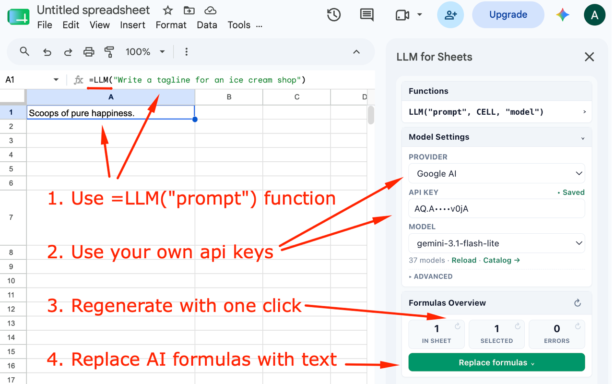

Ask any language model straight from a spreadsheet cell:

```
=LLM("Write a tagline for an ice cream shop")
=LLM("Translate to German:", A2)
=LLM("Summarise in 5 words:", A2, "gemini-3.6-flash")
```



## Bring your own key

No subscription, no credits, no account. Connect **OpenRouter**, **OpenAI**, **Anthropic**,
**Google AI**, or any OpenAI-compatible endpoint, and pay that provider directly at cost.

The add-on has no server. It runs entirely inside your Google account and talks only to the
provider you configure. Your API key is stored in your own script properties and is never
sent anywhere else — the developer has no way to read it.

## It does not re-bill you

Google Sheets recalculates formulas when a file is opened, when rows are added, when a
column is sorted. Every answer is cached permanently against its document, so none of that
costs a second request.

When you *do* want a fresh answer, one click regenerates the whole sheet, the current
selection, or only the cells that errored. Dependent formulas wait their turn instead of
burning credits on half-built prompts, and finished answers can be frozen into plain text
before you share the file.

## The model list is live

Models are fetched from your provider's own catalogue, so a new one appears the day it
ships. Nothing is hardcoded.

## Open source

MIT licensed — every claim above can be checked against four files of source.

[Source code](https://github.com/one-focus/llm-for-sheets) ·
[Privacy policy](privacy/) ·
[Terms of service](terms/)
